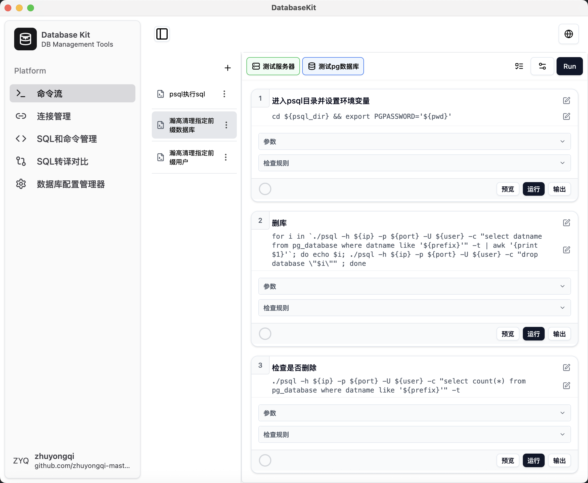

# Database Kit

A database management toolset, built with Electron + React + TypeScript, providing an intuitive graphical interface to manage database connections, execute commands, and edit configuration files.

[中文](./README.md) | **English**

## 🚀 Key Features

### 1. Command Stream Management
Execute single or multiple commands on servers. Supports dynamic placeholder replacement, direct result passing between commands, and execution result validation.

- **Server Selection**: Choose the server where commands will be executed. Available options come from "Server" configurations in "Connection Management".
- **Database Selection**: No actual operation, used for placeholder replacement. Available options come from "Database" configurations in "Connection Management".
- **Execution**: The top execution button runs the entire command stream, while each command's "Execute" button runs individual commands.
- **Parameters**: Parsed from placeholders in commands (placeholder format: ${}). Four types of placeholders:
    - **Plain Text**
    - **Previous Command Result**
    - **Server Information**: ip, port, username, password
    - **Database Name**: ip, port, username, password
- **Validation Rules**: Validate command execution results using regex or string matching. If validation fails during stream execution, subsequent commands will be stopped.
- **Preview**: Preview the actual command to be executed (after placeholder replacement). If parameters include server or database information, corresponding configurations must be selected for placeholder replacement.
- **Output**: Display command execution results. Shows error messages if execution fails.
- **JSON Import/Export**: Use the "plus" and "ellipsis" buttons in the sidebar to import and export command streams (in JSON format) for easy management and sharing.

### 2. Connection Information Management
Manage database connection information, including server and database connections. Primarily used for "Command Stream" and "SQL Migration Comparison" to execute remote commands. Supports adding, editing, and deleting connection information. Connection information can be imported/exported via JSON and quickly copied to clipboard.

- **Search & Sort**: Provides search and sorting functionality for connection lists (based on connection names).
- **JSON Import/Export**: Facilitates connection information management and sharing.
- **Three Hover Functions**:
    - **Copy**: Copy connection information to clipboard
    - **Export**: Export connection information as JSON
    - **Delete**: Delete connection information

### 3. SQL and Command Management
Manage SQL queries and system commands. Supports creating, editing, and deleting. Templates can be imported and exported via JSON.

- **Search & Sort**: Provides search and sorting functionality (based on connection names).
- **JSON Import/Export**: Facilitates connection information management and sharing.
- **Three Hover Functions**:
    - **Copy**: Copy SQL/command to clipboard
    - **Export**: Export connection information as JSON
    - **Delete**: Delete SQL/command

### 4. Command Diff
Compare differences before and after command execution (commands executed locally). Supports real-time comparison, visual differences, and placeholder commands.

- **Placeholders**: Automatically parsed from commands
- **Preview**: Preview the actual command to be executed (after placeholder replacement)
- **input**: Fixed placeholder for left-side input data

### 5. Database Configuration Editor
Edit and manage database configuration files with SSH connection support for remote servers. Supports local configuration file editing, remote configuration file management, configuration file backup, and pinning configurations for priority viewing. Parses and displays configurations based on "key-value pairs" (separated by "="). Does not parse comment lines starting with #.

- **Server Connection**: Location of the configuration to be parsed (local or remote server)
- **Configuration File Path**: Path to the configuration file to be parsed
- **Search**: Search by key name
- **Pin Keys**: Support configuration item priority settings
- **Reset**: Reset uncommitted configuration items to their parsed values
- **Commit**: Commit configuration item modifications (principle: modify the value of that line in the configuration file)
- **Backup**: Backup configuration file in the same path (backup filename: original filename + timestamp)
- **Edit**: Modify configuration item values. Modified but uncommitted configuration items will be marked as "uncommitted"

## 🛠️ Tech Stack

- **Frontend Framework**: React 19 + TypeScript
- **Desktop Application**: Electron
- **UI Components**: Radix UI + Tailwind CSS + shadcn/ui
- **State Management**: React Context API
- **Internationalization**: i18next
- **Build Tool**: Vite
- **Code Standards**: ESLint

## 📦 Installation and Running

### Requirements
- Node.js 18+
- npm or yarn

### Development Environment
```bash
# Clone the project
git clone https://github.com/zhuyongqi-master/database-kit.git
cd database-kit

# Install dependencies
npm install

# Start development server
npm run dev

# Start Electron application
npm run start
```

### Build and Package
```bash
# Build project
npm run build

# Package application
npm run package

# Create installer (macOS)
npm run make:darwin

# Create installer (Windows)
npm run make:win
```