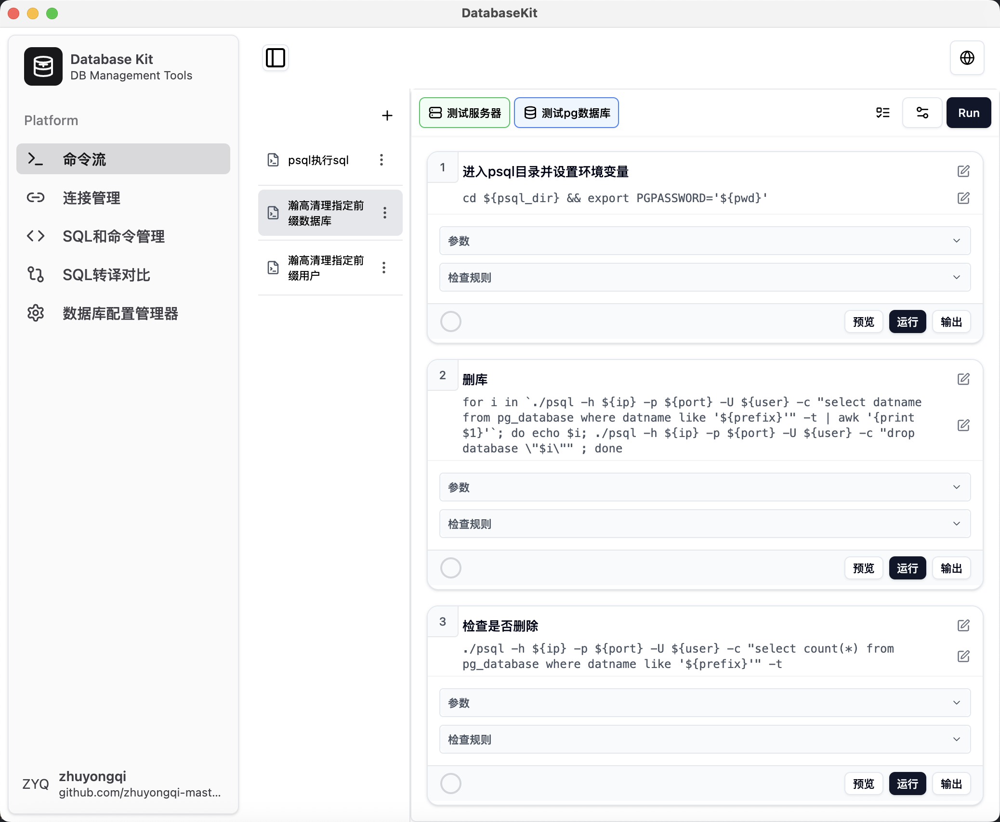
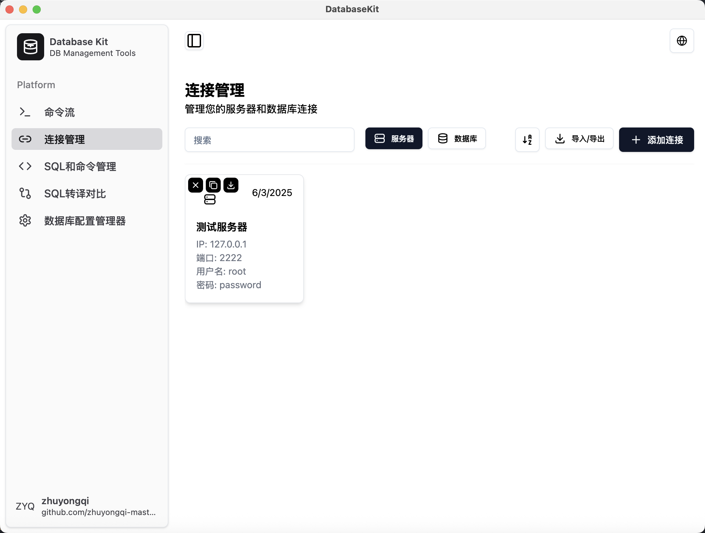
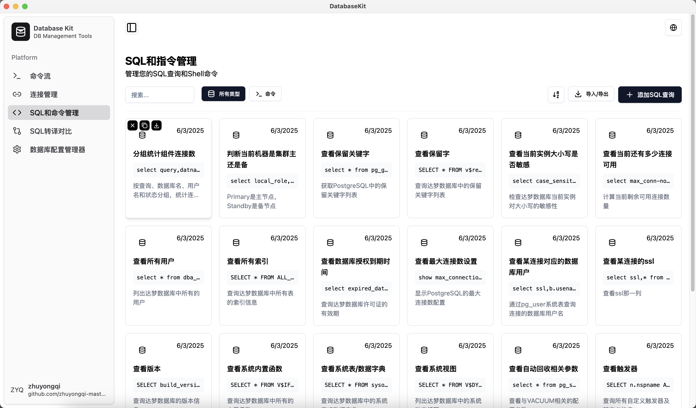
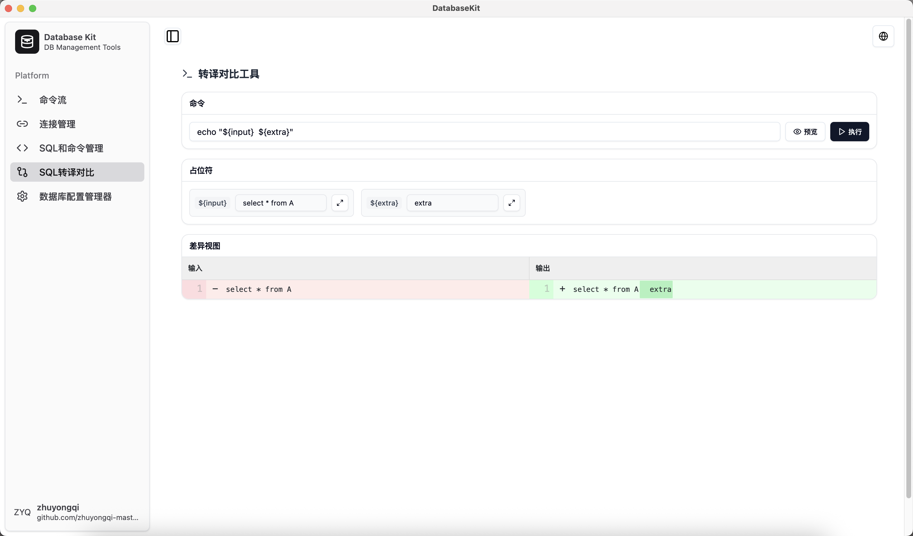
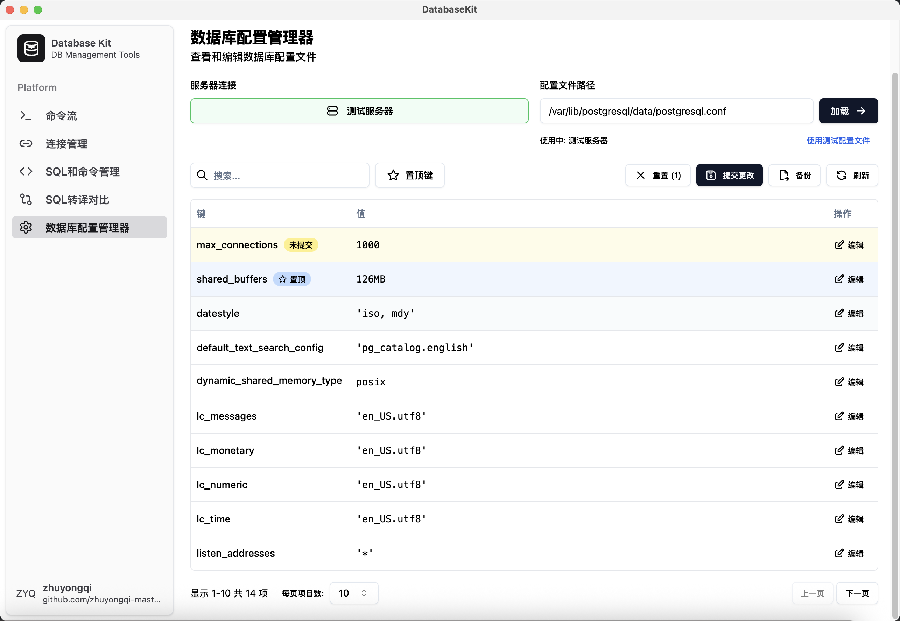

# Database Kit

一个数据库管理工具集，基于 Electron + React + TypeScript 构建，提供直观的图形界面来管理数据库连接、执行命令和配置文件编辑。

**中文** | [English](./README.en.md)

## 🚀 主要功能

### 1. 命令流管理 (Command Stream)
用于在服务器上执行单个或者一连串的指令。支持占位符动态替换、直接指令间传递指令结果、校验执行结果。

- **选择服务器**: 需要执行指令的服务器。可选来源为“连接管理”中的“服务器”配置。
- **选择数据库**: 并未有实际的操作，用于占位符替换。可选来源为“连接管理”中的“数据库”配置。
- **执行**: 上面的执行用于”执行“当前命令流，每个指令的“指令”用于执行当前指令。
- **参数**: 根据指令中的占位符解析得到（占位符规则为${}）。占位符有四种类型：
    - **纯文本**
    - **上一个指令的结果**
    - **服务器信息**：ip、port、username、password
    - **数据库名称**：ip、port、username、password
- **参数**: 根据指令中的占位符解析得到。占位符有四种类型：
- **检查规则**: 用于校验指令执行结果，支持正则表达式和字符串匹配。如果在指令流执行，某个指令检验失败会停止后续指令的执行。
- **预览**: 用于预览实际要执行的指令（在占位符替换后）。如果参数选择了服务器或者数据库信息，需要选择了相应的配置后才能替换对应的占位符信息。
- **输出**: 用于展示指令执行的结果。如果指令执行失败，会展示错误信息。
- **Json导入和导出**: 侧边栏的“加号”和“省略号”可用来导入和导出命令流（以json的格式），方便进行命令流的管理和分享。

### 2. 连接信息管理 (Connection Management)
    用于管理数据库连接信息，包括服务器连接和数据库连接。主要用于“命令流”、“SQL转移对比”执行远程指令。支持添加、编辑、删除连接信息。连接信息可以通过json进行导入和导出、快速复制到剪贴板。

- **搜索排序**: 提供连接列表的搜索和排序功能（基于连接名称）。
- **Json导入和导出**: 方便进行连接信息的管理和分享。
- **悬停的三个功能**: 
    - **复制**: 复制连接信息到剪贴板
    - **导出**: 将该连接信息导出为json
    - **删除**: 删除连接信息

### 3. SQL和命令管理 (SQL Command Management)
    用于管理SQL查询和系统命令。支持创建、编辑、删除。模板可以通过json进行导入和导出。

- **搜索排序**: 提供搜索和排序功能（基于连接名称）。
- **Json导入和导出**: 方便进行连接信息的管理和分享。
- **悬停的三个功能**: 
    - **复制**: 复制SQL/指令到剪贴板
    - **导出**: 将该连接信息导出为json
    - **删除**: 删除SQL/指令

### 4. 命令对比 (Command Diff)
    用于比较命令执行前后的差异（指令在本地执行）。支持实时对比、可视化差异、占位符指令等功能。

- **占位符**: 根据命令自动解析得到
- **预览**: 用于预览实际要执行的指令（在占位符替换后）
- **input**: 固定占位符，为左边的输入数据

### 5. 数据库配置编辑器 (DB Config Manager)
    用于编辑和管理数据库配置文件，支持 SSH 连接远程服务器。支持本地配置文件编辑和远程配置文件管理、支持备份配置文件、支持置顶想要优先查看的配置。根据配置文件的”键值对“（以“=”为间隔）解析配置并展示。不会解析以#开头的注释行。

- **服务器连接**: 要解析的配置所在位置（本地或者远程服务器）
- **配置文件路径**: 需要解析的配置文件路径
- **搜索**: 键名搜索
- **置顶键**: 支持配置项优先级设置
- **重置**: 重置未提交的配置项至解析时的值
- **提交**: 提交配置项的修改（原理：修改配置文件该行的值）
- **备份**: 在同路径下备份配置文件（备份文件名为：原文件名+时间戳）
- **编辑**: 修改配置项的值，修改且未提交的配置项会标记为“未提交”

## 🛠️ 技术栈

- **前端框架**: React 19 + TypeScript
- **桌面应用**: Electron
- **UI 组件**: Radix UI + Tailwind CSS + shadcn/ui
- **状态管理**: React Context API
- **国际化**: i18next
- **构建工具**: Vite
- **代码规范**: ESLint

## 📦 安装和运行

### 环境要求
- Node.js 18+
- npm 或 yarn

### 开发环境
```bash
# 克隆项目
git clone https://github.com/zhuyongqi-master/database-kit.git
cd database-kit

# 安装依赖
npm install

# 启动开发服务器
npm run dev

# 启动 Electron 应用
npm run start
```

### 构建和打包
```bash
# 构建项目
npm run build

# 打包应用
npm run package

# 制作安装包 (macOS)
npm run make:darwin

# 制作安装包 (Windows)
npm run make:win
```
